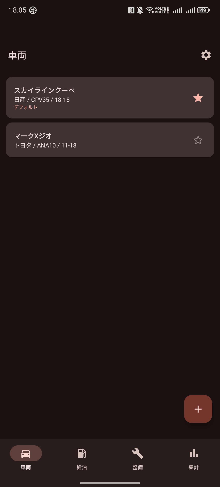
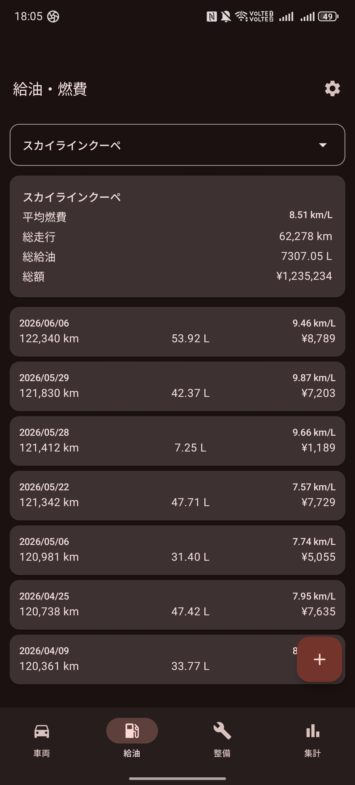
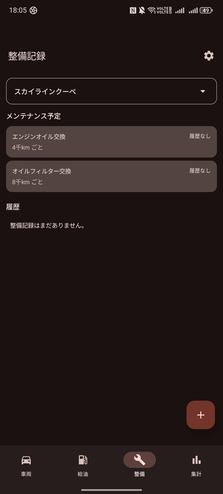
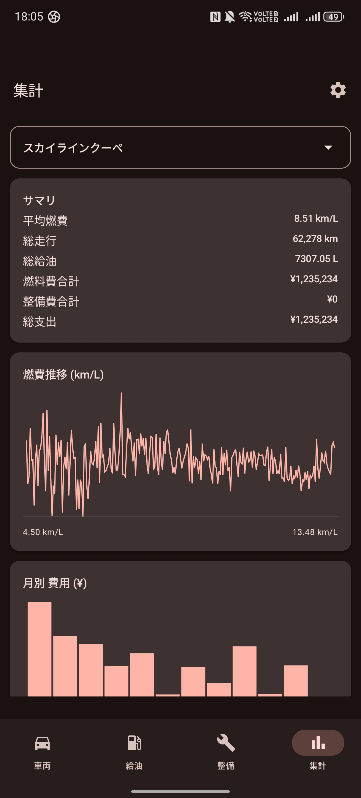

# Car Life Manager

複数の車両を登録し、給油記録から燃費を自動計算するAndroidアプリ。整備履歴と月別費用集計もまとめて管理できます。

- 完全ローカル動作（Roomで端末内に保存。サーバ不要）
- Kotlin + Jetpack Compose + Material 3
- minSdk 26 (Android 8.0) / targetSdk 35

## 機能

| タブ | できること |
|------|------------|
| 車両 | 複数台を登録・編集・削除。名前 / メーカー / 型式 / ナンバー / 初期走行距離 / タンク容量。デフォルト車両を 1 台選択 |
| 給油 | 給油の追加 (ステップ式ウィザード) ・編集。`満タン法` で区間燃費と平均燃費を自動計算 |
| 整備 | オイル交換・タイヤ・車検等のカテゴリで整備履歴を記録。プリセット周期 + 車両別オーバーライドで次回時期を表示 |
| 集計 | 燃費推移の折れ線グラフ、月別の燃料費 / 整備費 積み上げ棒グラフ |
| 設定 | 一般設定、車両、給油 (CSV インポートを含む)、整備周期、集計の各カテゴリ |

### ホーム画面ウィジェット

ホーム画面に「給油を追加」ウィジェットを追加できます。タップでアプリが起動し、即座に給油追加画面に遷移します。

- 1x1: アイコンのみのコンパクト版
- 2x1: アイコン + ラベル付き

### スクリーンショット

| 車両 | 給油 | 整備 | 集計 |
|------|------|------|------|
|  |  |  |  |

### 燃費計算について

満タン法を採用しています。

- 満タンを基準点とし、次の満タンまでの走行距離と給油量から `km/L` を算出
- 途中で半タン給油があっても、累積した給油量に正しく含めて計算
- 各車両ごとの「平均燃費」は最初の給油を基準点として除外したうえで算出

## セットアップ

JDK 17 と Gradle 8.10.2 が必要です。`.mise.toml` を同梱しているので [mise](https://mise.jdx.dev/) を使うと自動で揃います。

```bash
# 初回のみ
mise install

# Debug APK ビルド
./gradlew :app:assembleDebug

# 端末/エミュレータにインストール
adb install -r app/build/outputs/apk/debug/app-debug.apk
```

Android SDK のパスは `local.properties` の `sdk.dir` を環境に合わせて書き換えてください。

## プロジェクト構成

```
app/src/main/java/com/chun/carlife/
├── CarLifeApp.kt           # Application。DB シングルトンの保持
├── MainActivity.kt         # 唯一の Activity (ACTION_ADD_REFUEL 受信も担当)
├── data/                   # Room (Entity / DAO / AppDatabase / CsvImport)
├── domain/                 # UI 非依存ロジック (FuelEconomy, MaintenanceSchedule)
├── widget/                 # ホーム画面ウィジェット (RefuelShortcutWidget 1x1/2x1)
└── ui/
    ├── AppRoot.kt          # Navigation + BottomNavigation
    ├── theme/              # Material3 テーマ
    ├── util/               # 共通 (フォーマッタ / 車両セレクタ など)
    ├── vehicles/           # 車両一覧・編集
    ├── refuel/             # 給油一覧・追加ウィザード・編集
    ├── maintenance/        # 整備一覧・編集 + プリセット
    ├── stats/              # 集計・グラフ
    └── settings/           # 設定（一般 / 車両 / 給油 / CSV インポート / 整備 / 集計）
```

データは `car-life.db` に保存されます。スキーマ変更時は `AppDatabase` の `version` を上げ、対応する `Migration` を `addMigrations(...)` に追加してください。

## 今後やりたいこと

- [ ] CSV エクスポート
- [ ] オイル交換周期などのリマインダー通知
- [ ] バックアップ・復元
- [ ] 給油記録のグラフ拡張（単価推移など）
